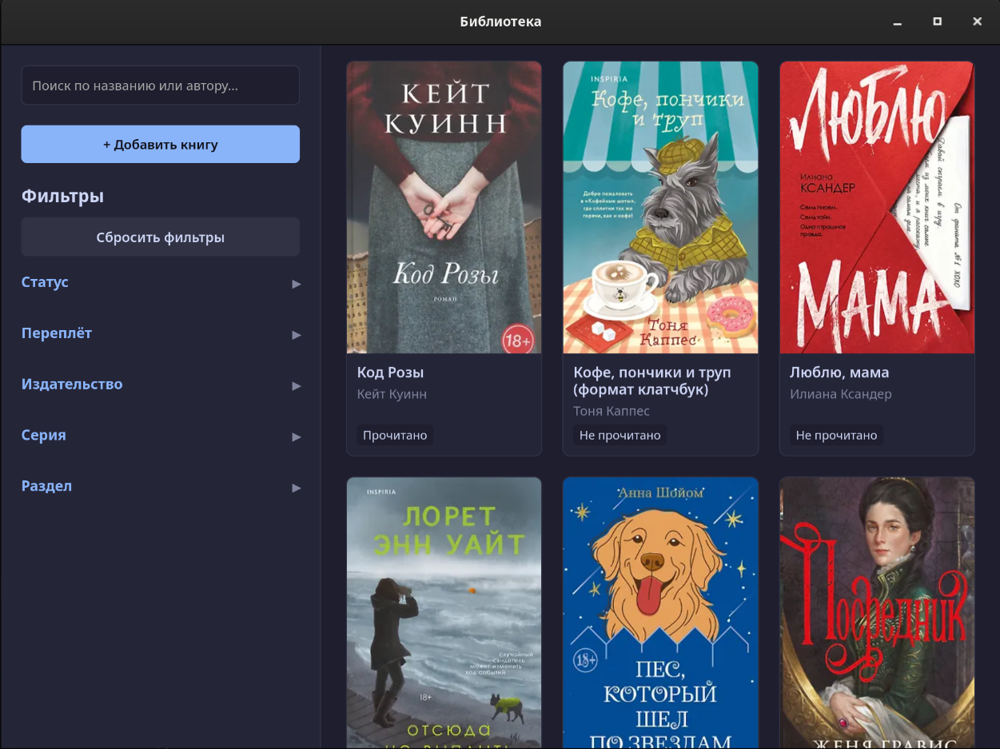
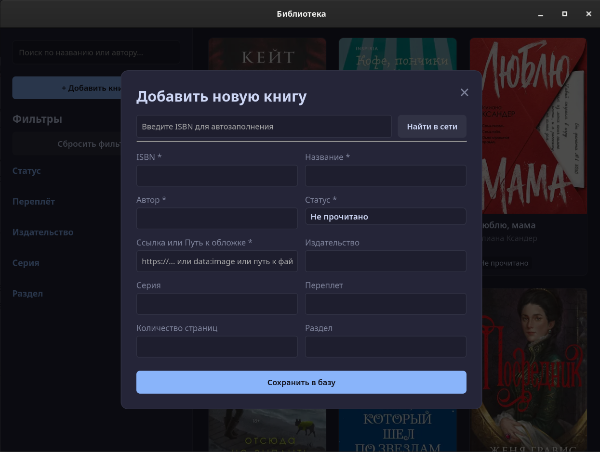
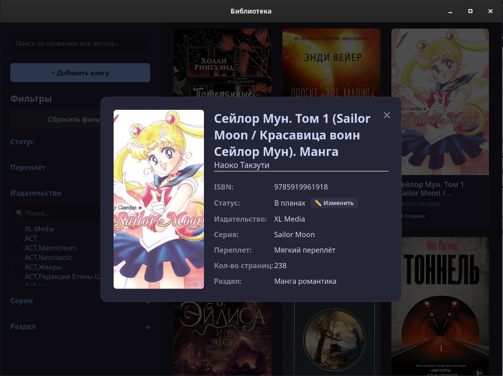

# Локальная библиотека книг

Это десктопное приложение для каталогизации личной библиотеки. Оно представляет собой легковесную CRUD-обертку над базой данных SQLite, написанную на [Tauri v2](https://v2.tauri.app/) и чистом **Vanilla JS** (без тяжелых фронтенд-фреймворков).

# Функции
- **Красивый и удобный UI/UX**: Стиль интерфейса полностью выполнен в палитре Catppuccin Mocha.
- **Гибкие фильтры**: Доступна фильтрация по статусам чтения, типам переплета, издательствам, сериям и секциям. Для последних трех категорий добавлен удобный внутренний поиск.
- **Парсинг по ISBN**: Быстрое добавление книг без рутины. Достаточно ввести ISBN, и приложение автоматически подтянет всю информацию о книге из интернет-магазина [Буквоед](https://www.bookvoed.ru/).
- **Умный живой поиск**: Поиск по названиям и авторам реализован по принципу поисковой строки в браузере — интерфейс моментально реагирует на любое совпадение прямо во время ввода.
- **Оптимизация на уровне SQL**: База данных спроектирована под большие объемы данных. Грамотное использование индексов и выделение отдельных колонок для авторов и названий в нижнем регистре (lowercase) гарантирует молниеносную скорость работы.

# Скриншоты
<details>
<summary>📸 Нажмите, чтобы посмотреть скриншоты интерфейса</summary>

<br/>

<br/><br/>

<br/><br/>


</details>

# Установка и сборка

### Nix (Для Linux)
Самый надежный способ для Linux-дистрибутивов, исключающий ручную установку системных библиотек WebKit. Требуется пакетный менеджер [Nix](https://nixos.org/download/#download-nix):
```bash
git clone https://github.com/d3hhy54/local-library-books.git
cd local-library-books
nix-shell
# Устанавливаем фронтенд-зависимости и собираем проект
npm install
npx tauri build
```

### macOS
Для сборки приложения на macOS системные веб-компоненты уже встроены. Вам понадобятся только инструменты разработки Xcode и [Rust](https://rust-lang.org/tools/install):
```bash
# Установка инструментов командной строки Xcode (если еще не установлены)
xcode-select --install

# Установка Rust
curl --proto '=https' --tlsv1.2 -sSf https://sh.rustup.rs | sh

# Сборка проекта
git clone https://github.com/d3hhy54/local-library-books.git
cd local-library-books
npm install
npx tauri build
```

### Windows
Разработка и тестирование на Windows не проводились. Теоретически процесс сборки аналогичен macOS: вам понадобятся Rust, установленный Node.js и стандартные инструменты сборки C++ (Visual Studio Build Tools) для компиляции бэкенда.
```bash
git clone https://github.com/d3hhy54/local-library-books.git
cd local-library-books
npm install
npx tauri build
```
